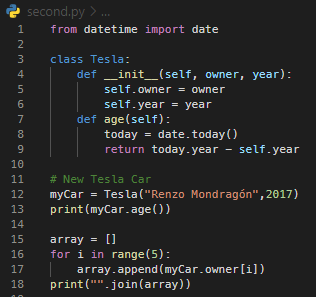
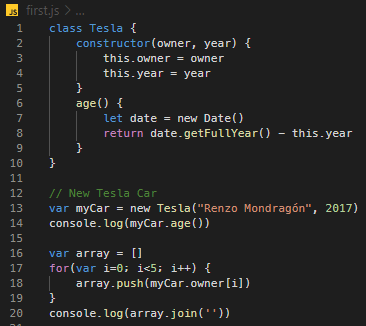
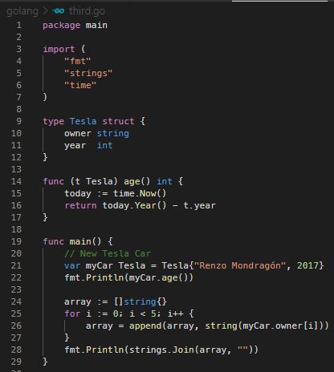
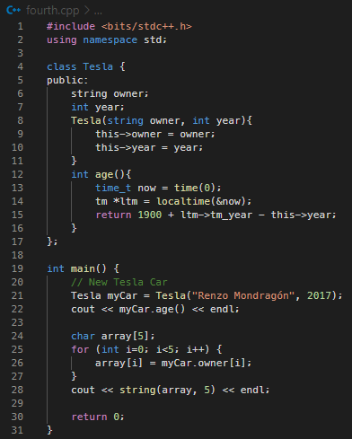
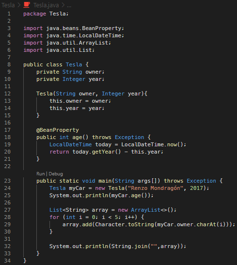

# Google Colab Dark Theme for VSCode

This is a Visual Studio Code theme that was made inspired on the color palette of Google Colab Dark theme.

As a student, since i don't have a good GPU, i have spent too much time on Google Colab training my machine learning models with the amazing library Tensorflow. I really like colab's theme because it focuses on simplicity and also doesn't have a negative impact in my concentration or strain in eyes. For this reason, I always turn the Dark theme on.

## **Pictures!**

This theme has been tested on only five languages since they are the only ones i know. I tried to port the colab experience to other languages as well. You can submit any issues with them i will always read them!

### Python:

### JavaScript:

### Golang:

### C++:

### Java:
